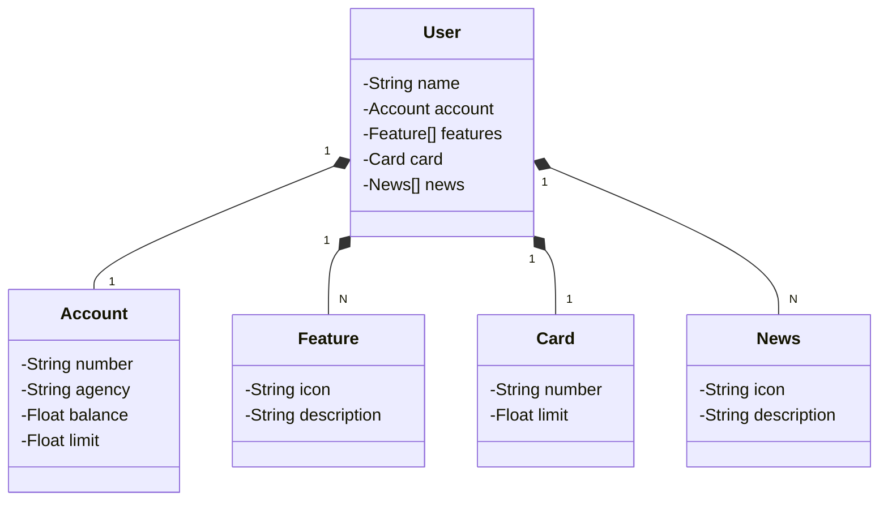

# Santander Dev Week
 Java Restful API criada para standerdevweek

## Tecnologias Utilizadas

Este projeto utiliza um conjunto de tecnologias modernas e eficientes para criar aplicações robustas e escaláveis:

* **Java 17:** A versão LTS (Long Term Support) mais recente do Java, garantindo acesso a recursos inovadores e suporte de longo prazo.
* **Spring Boot 3:** A última versão do framework Spring Boot, que simplifica o desenvolvimento de aplicações Java com sua abordagem de autoconfiguração e foco em produtividade.
* **Spring Data JPA:** Uma ferramenta poderosa para facilitar o acesso a dados em bancos de dados SQL, reduzindo a necessidade de escrever código boilerplate e otimizando o desenvolvimento.
* **OpenAPI (Swagger):** Uma especificação amplamente utilizada para descrever APIs RESTful, permitindo a geração automática de documentação interativa e facilitando a integração entre sistemas.
* **Railway:** Uma plataforma moderna para implantação e gerenciamento de aplicações na nuvem, oferecendo recursos como bancos de dados como serviço, pipelines de CI/CD e monitoramento simplificado.

Essa combinação de tecnologias proporciona um ambiente de desenvolvimento ágil e eficiente, permitindo a criação de APIs bem documentadas e aplicações escaláveis com facilidade.

## Diagrama de Classes 

